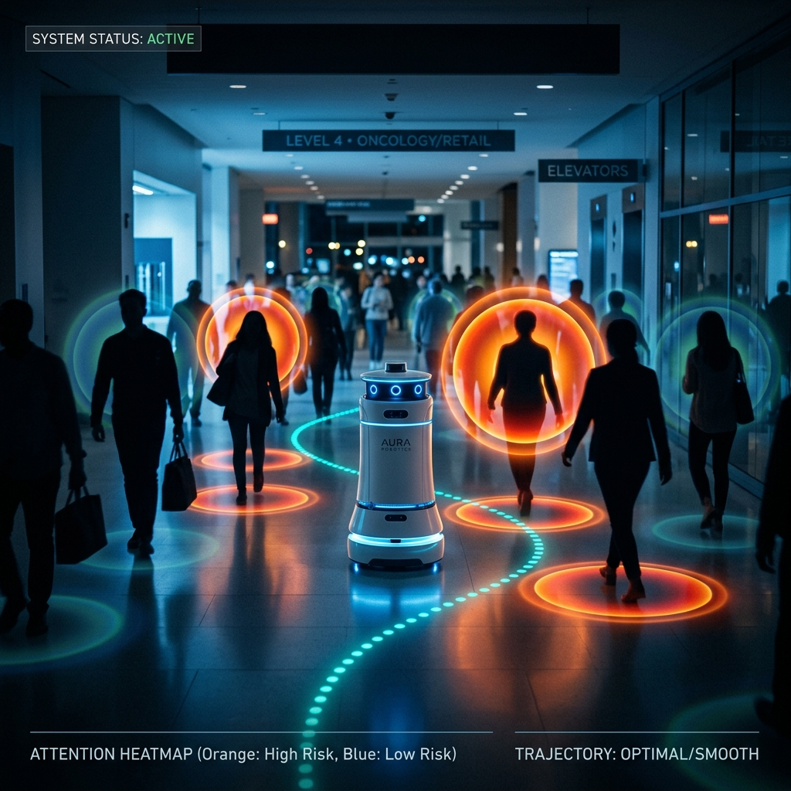
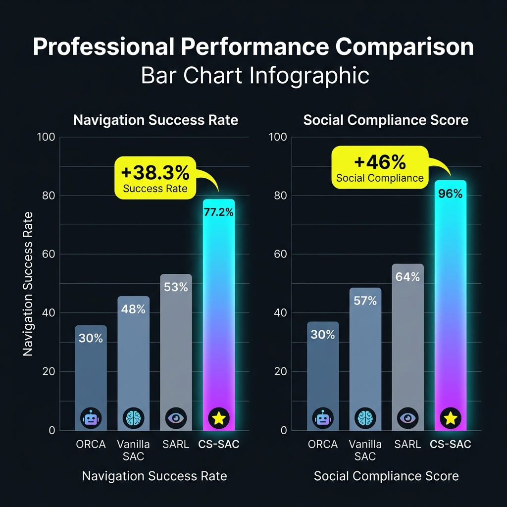
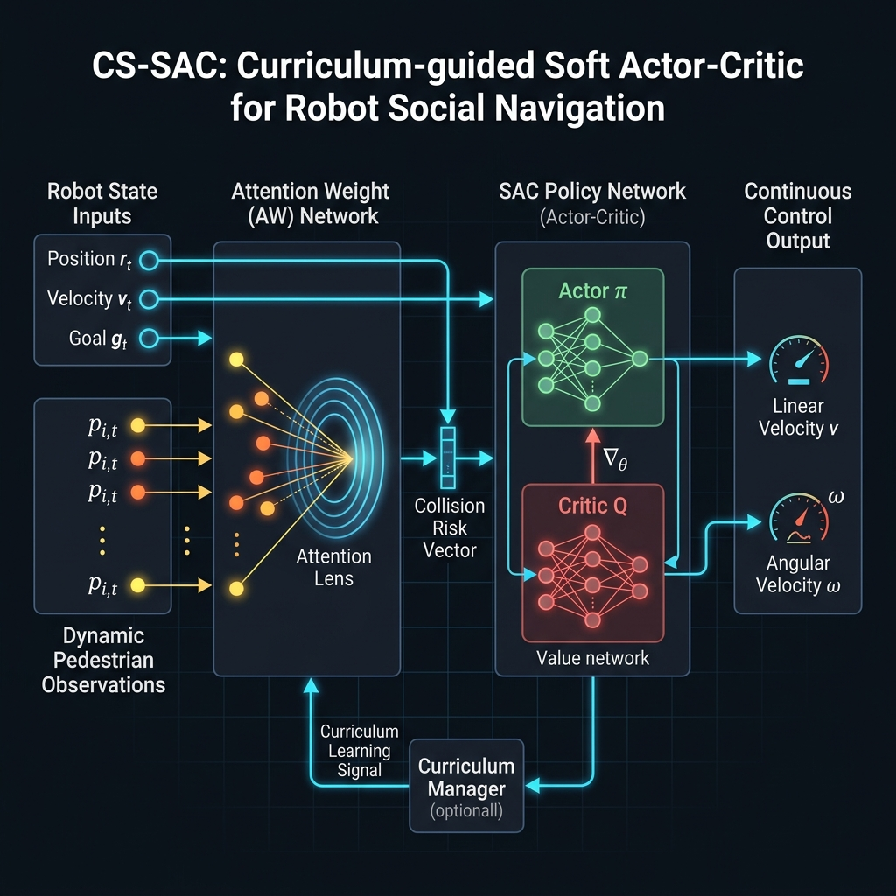
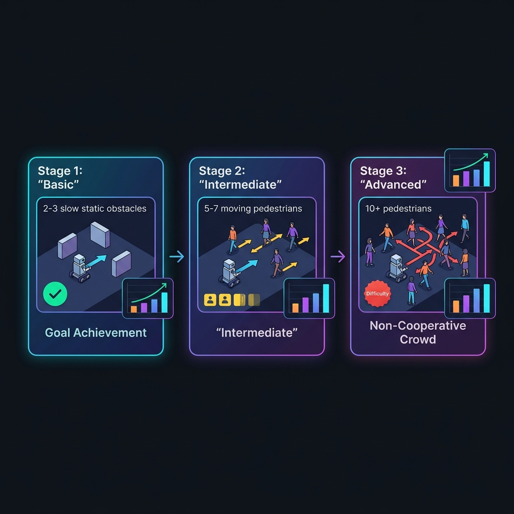

# CS-SAC：面向複雜社交場景的機器人導航框架

> **Curriculum-guided Soft Actor-Critic for Robot Social Navigation**
> 
> 透過注意力權重網路 × 課程學習排程器 × 最大熵 SAC 核心，突破服務型機器人在高密度人群中的導航瓶頸。

<p align="center">
  
  <br>
  <em>CS-SAC 機器人在擁擠環境中的社交感知導航 — 橙色光環代表高風險行人，青色路徑為動態規劃軌跡</em>
</p>

---

## 📌 目錄

- [背景與動機](#背景與動機)
- [核心挑戰](#核心挑戰)
- [技術對比](#技術對比)
- [系統架構](#系統架構)
- [核心組件](#核心組件)
- [課程學習訓練](#課程學習訓練)
- [性能結果](#性能結果)
- [MDP 框架定義](#mdp-框架定義)


---

## 背景與動機

隨著服務型機器人深度滲入醫院、商場及辦公大樓等公開場合，導航技術正經歷一場深刻的**範式轉移**：

```
傳統幾何避障  →  社交合規決策
```

現代場景中，導航任務不再只是計算一條「不碰撞的幾何路徑」，而是必須同時滿足：

| 維度 | 要求 |
|------|------|
| 🛡️ 安全性 | 零碰撞，實時感知行人動態 |
| ⚡ 效率性 | 最短時間抵達目標 |
| 🔮 預測性 | 行為可被周圍人預判 |
| 😊 舒適度 | 不侵入人類個人空間 |

---

## 核心挑戰

CS-SAC 針對現有系統的**兩大底層瓶頸**提出根本性解法：

### ❄️ 問題一：機器人凍結 (Freezing Robot Problem)

傳統基於幾何規則的演算法（如 ORCA、SFM）依賴**過於保守的硬性安全閾值**。

> 當環境複雜度超過規則邊界時，系統頻繁找不到可行解，導致機器人因陷入「無解困境」而**原地停滯或任務超時**。

### 🕳️ 問題二：學習陷阱 (Learning Trap)

深度強化學習（DRL）雖具備端對端處理潛力，但在高維動態特徵下，極易遭遇**稀疏獎勵（Sparse Rewards）問題**。

> 模型在訓練初期因暴力拼接（Flatten）高維特徵破壞空間拓樸關係，易掉入「U 型陷阱」，導致梯度崩潰、無法收斂。

---

## 技術對比

<p align="center">
  
  <br>
  <em>CS-SAC vs. 主流導航方法在成功率與社交合規性上的量化比較</em>
</p>

| 技術流派 | 處理動態高維特徵 | 避免局部最佳解 | 軌跡平滑性 | 收斂速度 |
|---------|:-:|:-:|:-:|:-:|
| 規則模型 (ORCA / SFM) | ❌ | ❌ | ➖ | ✅ |
| 標準 DRL (Vanilla SAC / DDPG) | ➖ | ❌ | ➖ | ➖ |
| 單一注意力模型 (SARL) | ✅ | ➖ | ➖ | ❌ |
| **CS-SAC（本方案）** | ✅ | ✅ | ✅ | ✅ |

---

## 系統架構

<p align="center">
  
  <br>
  <em>CS-SAC 完整系統架構：AW 網路 → SAC 策略網路 → 連續控制輸出</em>
</p>

CS-SAC 的三層核心處理流程：

```
[動態行人觀測 + 機器人自身狀態]
           │
           ▼
  ┌─────────────────────┐
  │  注意力權重 (AW) 網路  │  ← 計算碰撞風險特徵向量
  │  "Attention Lens"   │     解決置換不變性問題
  └────────┬────────────┘
           │  固定維度的精煉特徵
           ▼
  ┌─────────────────────┐
  │   最大熵 SAC 核心    │  ← Actor π + Critic Q
  │  (Actor-Critic)     │     最大化策略熵 α
  └────────┬────────────┘
           │
           ▼
  ┌─────────────────────┐
  │   連續控制輸出       │  → 線速度 v + 角速度 ω
  └─────────────────────┘
           ↑
  [課程學習排程器] 動態調整訓練難度
```

---

## 核心組件

### 🔭 1. 注意力權重 (AW) 網路

AW 網路引入 **"Attention Lens（注意力透鏡）"** 機制，克服傳統 Flatten 方式對空間理解的破壞。

**技術原理：**
- 動態映射周圍行人對機器人的**潛在碰撞風險**
- 輸出固定維度的 **碰撞風險特徵向量 (Collision Risk Feature Vector)**
- 確保模型具備**置換不變性 (Permutation Invariance)**，可處理數量變動的行人

**核心優勢：**

```
輸入：[p₁, p₂, ..., pₙ] (n 可變)
         │  Attention Weights
         ▼
輸出：固定維度的風險向量  (n 無關)
```

### 🧠 2. 最大熵 SAC 核心

SAC（Soft Actor-Critic）在目標函數中引入**熵獎勵 α**，防止策略過早收斂：

$$\pi^* = \arg\max_\pi \mathbb{E}\left[\sum_t r(s_t, a_t) + \alpha \mathcal{H}(\pi(\cdot | s_t))\right]$$

| 特性 | 效果 |
|------|------|
| **穩定性** | 顯著提升對高動態不可預知環境的適應力 |
| **平滑度** | 線速度 v 與角速度 ω 指令極度平滑（無鋸齒顫動）|
| **安全性** | 生成符合人類直覺的社交安全距離 |

---

## 課程學習訓練

<p align="center">
  
  <br>
  <em>由簡入深的三階段訓練排程，有效避免超時陷阱與局部最佳解</em>
</p>

為防止機器人在複雜環境中因盲目探索觸發**超時陷阱 (Timeout Trap)**，CS-SAC 實施由簡入深的三階段訓練：

```
階段一 → 階段二 → 階段三
基礎能力  特徵識別  極端場景
```

#### 🟢 階段一：基礎（Basic）

| 設定 | 內容 |
|------|------|
| 環境 | 靜態障礙物 + 2-3 位低速行人 |
| 目標 | 建立基礎目標達成能力 |
| 評估指標 | 目標到達率 |

#### 🟡 階段二：中階（Intermediate）

| 設定 | 內容 |
|------|------|
| 環境 | 5-7 位行人，提升密度與路徑隨機性 |
| 目標 | 訓練 AW 網路的高效特徵識別與風險鎖定能力 |
| 評估指標 | 社交距離維持率 + 成功率 |

#### 🔴 階段三：高階（Advanced）

| 設定 | 內容 |
|------|------|
| 環境 | 10+ 高密度**非合作性（Non-cooperative）**人群交錯 |
| 目標 | 強化極端情況下的社交合規性與避障韌性 |
| 評估指標 | 全指標綜合評估 |


---

## MDP 框架定義

CS-SAC 將社交導航形式化為**馬可夫決策過程 (MDP)**，並對核心要素進行重新定義：

### 狀態空間 S

```
S = {robot_state, pedestrian_observations}
  = {位置, 速度, 目標方向} ∪ {pᵢ = (位置, 速度, 預測意圖) | i = 1..n}
```

### 動作空間 A

採用**端對端連續控制輸出**，直接輸出：

```
A = (v, ω)    # 線速度 × 角速度
```

### 轉移機率 P

由於行人意圖難以預測，系統設計為 **Model-free**，不依賴顯式的環境模型。

### 獎勵函數 R

```
R = r_goal + r_collision + r_social_distance + r_time_penalty

其中：
  r_goal            : +大正值（抵達目標）
  r_collision       : -大負值（發生碰撞）
  r_social_distance : +小正值（維持社交距離）
  r_time_penalty    : -小負值（時間步懲罰，促進效率）
```

---


---

<p align="center">
  Made with ❤️ for safer, smarter, more socially-aware robots.
  <br>
  <sub>CS-SAC © 2026 — All Rights Reserved</sub>
</p>
